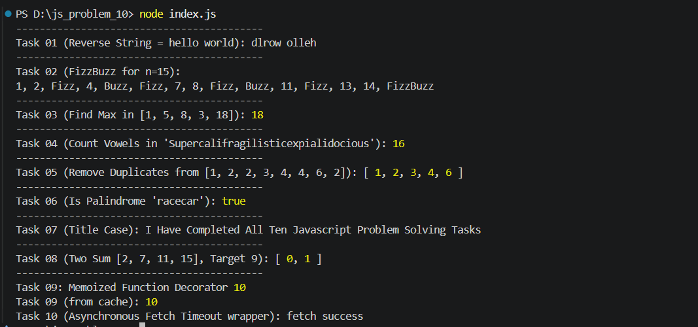

# JavaScript Problem Solving Roadmap

This repository contains my solutions for 10 JavaScript coding tasks. The challenges go from basic syntax and string/array manipulation to more advanced topics like closures and async programming.

---

## Overview of the Tasks

### 🟢 Easy Level
- **Task 01: Reverse a String**  
  Takes a string and returns it reversed using string and array methods.
- **Task 02: FizzBuzz Scenario**  
  Loops through numbers from 1 to `n`. Replaces multiples of 3 with "Fizz", multiples of 5 with "Buzz", and multiples of both with "FizzBuzz".
- **Task 03: Find the Largest Number**  
  Finds and returns the highest number in an array using `Math.max()`.

---

### 🟡 Basic to Intermediate Level
- **Task 04: Count Vowels**  
  Counts the total number of vowels (`a, e, i, o, u`) inside a string, ignoring letter cases.
- **Task 05: Remove Duplicates from Array**  
  Takes an array with repeated items and returns a new array with only unique values using `Set`.
- **Task 06: Check for Palindrome**  
  Checks if a phrase reads the same forward and backward, ignoring extra spaces and punctuation.
- **Task 07: Title Case a Sentence**  
  Capitalizes the first letter of each word in a sentence and keeps the rest lowercase.

---

### 🔴 Advanced Level
- **Task 08: Two Sum Algorithm**  
  Finds the index positions of two numbers in an array that add up to a target number using a Hash Map (`Map`) for faster $O(n)$ speed.
- **Task 09: Memoized Function Decorator**  
  A wrapper function that stores calculation results in a cache. If the same input is passed again, it returns the result from memory instead of recalculating.
- **Task 10: Asynchronous Fetch Timeout**  
  Makes an API request with a timeout limit using `Promise.race()`. If the server takes too long, it cancels and shows a timeout error.

---



## How to Run the Code

1. Make sure you have **Node.js** installed on your computer.
2. Open your terminal in this project folder.
3. Run the following command:

```bash
node index.js